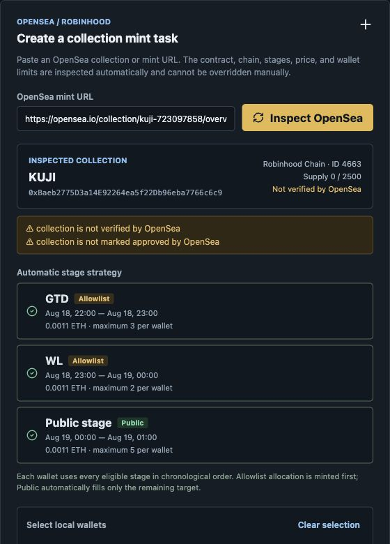

# MintDesk Robinhood

[](https://github.com/bizipoopoo/MintDesk/actions/workflows/ci.yml)
[](https://github.com/bizipoopoo/MintDesk/releases)
[](LICENSE)

MintDesk is an open-source Wails desktop application and Go toolset for monitoring and executing explicitly armed NFT mint tasks on Robinhood Chain. It supports OpenSea drop inspection, encrypted local wallet imports, multiple wallet tasks, scheduled pre-mint watching, transaction simulation, cost caps, and nonce-safe concurrency.

> **Financial and key-safety warning:** NFT minting can lose funds. Use a dedicated hot wallet with a limited balance. Verify every collection, stage, contract interaction, chain, quantity, and cost limit yourself. Never paste a valuable primary wallet or commit private keys, recovery phrases, keystores, RPC credentials, or signing certificates.

## Donate

If MintDesk is useful to you, you can support its continued open-source development with an EVM-wallet donation.

**EVM address:** `0xd439325794932c3ccd45affa85effe5363af1ca8`


The QR code contains only the address above. Use an EVM-compatible wallet and network, verify the full address before sending, and confirm that your selected network and token are supported. Blockchain transfers are generally irreversible.

## Downloads

[GitHub Releases](https://github.com/bizipoopoo/MintDesk/releases) publish these unsigned community builds for every `v*` release tag:

- `MintDeskRobinhood-macOS-universal.zip` for Apple Silicon and Intel Macs.
- `MintDeskRobinhood-Windows-x64-Setup.exe` for Windows x64.
- `MintDeskRobinhood-Windows-x64-portable.zip` for a portable Windows x64 executable.

The macOS build is ad-hoc signed but not Apple-notarized. The Windows build is not signed with a commercial code-signing certificate, so macOS Gatekeeper or Windows SmartScreen may show a warning. Verify release provenance and checksums before running downloaded wallet software.

## Command-line monitor

`mint-watch` watches an EVM NFT drop through an RPC endpoint. OpenSea is useful for finding a collection, but the sale state and mint transaction live on that collection's smart contract, so this tool treats the chain as the source of truth.

The program reads a no-argument boolean sale function such as `saleActive()` every few seconds. When the configured value is observed it sends an optional Discord-compatible webhook and prints the exact configured transaction. Broadcasting is disabled by default.

## Setup

```sh
cp config.example.json config.json
go mod tidy
go run ./cmd/mint-watch --config config.json --once
```

Fill `config.json` only from the project's official contract and mint documentation:

- `contract`: the verified mint contract address on the correct network.
- `sale_check.function`: a no-argument view function that returns `bool`, for example `publicSaleActive()` or `saleActive()`. It is contract-specific.
- `mint_calldata`: the complete ABI-encoded mint call, including its 4-byte selector. Obtain it from the verified contract ABI or a transaction simulation; do not guess it from an OpenSea listing.
- `mint_value_wei`: the exact total mint price in wei, including quantity but excluding gas.
- `max_gas_price_wei`: the maximum gas price you are willing to pay in wei. Required for `--execute`.
- `max_total_cost_wei`: the maximum `mint_value_wei + gas_limit * gas_price` in wei. Required for `--execute`.
- `rpc_url`: a private RPC endpoint appropriate to the chain. Public endpoints often rate-limit polling.

The optional webhook uses Discord's `{ "content": "..." }` request format. Leave it blank to print only to the terminal.

## Monitoring

Run continuously:

```sh
go run ./cmd/mint-watch --config config.json
```

For an initial read-only validation:

```sh
go run ./cmd/mint-watch --config config.json --once
```

## Broadcasting a mint transaction

Transaction broadcast is intentionally opt-in. The private key is never read from configuration or written to disk. Use a dedicated hot wallet funded only with the amount you are prepared to spend, and verify the transaction against the official drop before launching it.

```sh
export MINT_PRIVATE_KEY='0x...'
go run ./cmd/mint-watch --config config.json --execute --confirm-transaction
unset MINT_PRIVATE_KEY
```

`--execute` has no retry loop after a successful broadcast. A transaction being accepted by the RPC does not guarantee a mint: eligibility, supply, per-wallet limits, and contract conditions can still cause it to revert or remain pending. Review the chain explorer transaction after broadcast.

## Limits

There is no universal OpenSea mint ABI. Contracts can use allowlists, signatures, proof arguments, time windows, ERC-721A methods, or third-party mint providers. This starter handles the common `bool` sale gate and a pre-encoded transaction. For a specific collection, inspect its verified contract ABI and adapt the check/call before using `--execute`.

## Local mint task runner

`mint-task` is a task manager for one-shot automatic mints. It keeps imported keys in a password-encrypted geth keystore under `mint-data/keystore`; tasks only contain the public wallet address. It does not save a raw private key in JSON.

Initialize the local store, then import a dedicated hot wallet. Do not use a wallet that contains assets you are not prepared to expose to a mint contract.

```sh
go run ./cmd/mint-task init
export MINT_PRIVATE_KEY='0x...'
export MINT_KEYSTORE_PASSWORD='use-a-strong-local-password'
go run ./cmd/mint-task wallet import
unset MINT_PRIVATE_KEY
go run ./cmd/mint-task wallet list
```

Copy `task.example.json` to a separate local file and fill it only with details taken from the collection's official verified contract. `quantity: 100` works for the common payable `mint(uint256)` ABI. When the mint function needs allowlist proofs, signatures, multiple arguments, or any other non-standard field, set the verified complete ABI call in `raw_calldata` instead. The runner does not invent proofs or bypass eligibility checks.

```sh
go run ./cmd/mint-task task create --file task.json
go run ./cmd/mint-task task list
```

Armed execution is explicit and broadcasts only once after the sale check reports the expected boolean value:

```sh
export MINT_KEYSTORE_PASSWORD='use-a-strong-local-password'
go run ./cmd/mint-task run --armed
```

Each task checks the RPC network ID, simulates the transaction through gas estimation, enforces `max_gas_price_wei` and `max_total_cost_wei`, then signs from the encrypted local wallet. It disables the task after either a broadcast or a failed mint attempt, so re-arming requires `task enable --id <task-id>` after review.

## Desktop app

### Desktop quick start (KUJI example)

This walkthrough covers the complete path from importing dedicated wallets to creating an automatic multi-stage mint strategy. See the [full desktop guide](docs/desktop-guide.md) for detailed installation notes, troubleshooting, and a pre-flight safety checklist.

> [!CAUTION]
> [KUJI](https://opensea.io/collection/kuji-723097858/overview) is used only to demonstrate the interface. This is not a recommendation or endorsement. The screenshot was captured on August 17, 2026 (GMT+8); at that time, the collection was **Not verified by OpenSea**, was not marked approved, and had no official website or X account that could be cross-checked. Project pages and mint stages can change. Reconfirm the project identity, contract, chain, schedule, price, and limits before arming a task.

#### 1. Download the app and create a local wallet vault

Download the appropriate build from [GitHub Releases](https://github.com/bizipoopoo/MintDesk/releases). Community builds are not Apple-notarized or commercially code-signed for Windows. Bypass Gatekeeper or SmartScreen only after confirming the Release source and any published checksums.

Open **Wallets** and choose one way to add wallets:

- **Private keys**: batch-import one private key per line.
- **Import phrase**: derive 1–20 EVM addresses from an existing recovery phrase.
- **Generate**: create a new 24-word recovery phrase and derive addresses at `m/44'/60'/0'/0/i`.

Set a **Keystore password** and import the wallets. Private keys are written to the encrypted local keystore; task data contains only public addresses. A newly generated recovery phrase is displayed once, so back it up offline. Use only dedicated hot wallets with limited balances, never a primary wallet.

#### 2. Inspect the KUJI OpenSea page

Open **Mint tasks** and paste:

```text
https://opensea.io/collection/kuji-723097858/overview
```

Click **Inspect OpenSea**. The app reads the contract, Robinhood Chain, supply, OpenSea verification flags, stage schedule, price, and per-wallet limits. These values cannot be manually overridden in the task form.



The screenshot contains only public project information; local wallets and RPC credentials were cropped out. At capture time, MintDesk parsed:

| Stage | Time (GMT+8) | Price | Per-wallet limit | Desktop strategy |
| --- | --- | --- | --- | --- |
| GTD | August 18, 2026, 22:00–23:00 | 0.0011 ETH | 3 | Automatic allowlist attempt |
| WL | August 18, 2026, 23:00–August 19, 00:00 | 0.0011 ETH | 2 | Automatic allowlist attempt |
| Public | August 19, 2026, 00:00–01:00 | 0.0011 ETH | 5 | Automatic remainder |

The contract was `0xBaeb2775D3a14E92264ea5f22Db96eba7766c6c9`, the supply was 2,500, and the Chain ID was `4663`. The app displays times in the computer's local timezone, so confirm that the system clock and timezone are correct.

MintDesk supports SeaDrop **Signed Presale (`SIGNED_PRESALE`)**, **Merkle Presale (`MERKLE_PRESALE`)**, and **Public (`PUBLIC_SALE`)** stages. The task stores every supported stage instead of forcing one global choice for all wallets. While an allowlist stage is live, MintDesk asks OpenSea for that wallet's exact signed or Merkle calldata, validates the returned collection, SeaDrop target, wallet, quantity, price, time window, stage index, fee recipient, and value, and then simulates it before signing locally. It never invents a signature or proof.

The target is per wallet and is filled chronologically. For example, if the target is 5 and one wallet has a WL allowance of 2, that wallet mints 2 during WL and Public later fills only the remaining 3. A wallet without WL eligibility simply waits for Public and mints up to the remaining target there. This decision is independent for every imported wallet, so a 100-wallet task can contain 3 WL-eligible wallets and 97 Public-only wallets without separate collection tasks.

#### 3. Create the automatic multi-stage task

Complete the fields below the inspection result:

1. **Select local wallets**: choose dedicated hot wallets; the app creates one task per wallet.
2. **Mint quantity per wallet**: enter the final target for each wallet. It must not exceed the highest wallet limit across the included stages. Earlier on-chain mints count toward this target and the SeaDrop limits.
3. **Mint monitoring speed**: choose Extreme (100 ms), Fast (500 ms), Slow (2 seconds), or Very slow (5 seconds).
4. **Maximum fee per gas (Gwei)**: set the highest gas fee you are willing to accept.
5. **Maximum total cost per wallet (ETH)**: set a safety cap large enough for the highest possible mint value and every transaction the strategy may need. Each transaction is also checked against this cap immediately before signing.
6. **Robinhood RPC**: enter a trusted Chain ID 4663 RPC endpoint. Private URLs may contain API keys; never screenshot or commit them to GitHub.
7. Click **Create collection for N wallets**.

Wallets sharing one RPC endpoint are rate-limited together. A faster monitoring speed does not bypass provider limits. If requests time out or return `429`, choose a slower speed or a more reliable endpoint.

#### 4. Arm, run, and stop

Return to **Overview**, verify **Enabled tasks**, and then:

1. Enter the keystore password.
2. Select **I understand this may broadcast real transactions.**
3. Click **Arm & start**.

Future tasks wait on a local timer and connect to the RPC about one minute before the stage starts. The app must stay open, and the computer must remain awake and online. Before broadcasting, MintDesk rechecks the Chain ID, SeaDrop price and schedule, wallet mint count, remaining supply, fee recipient, balance, gas and total-cost caps, and then simulates the transaction.

One wallet strategy can broadcast an allowlist transaction and a later Public remainder transaction. MintDesk waits for the allowlist receipt before calculating the remaining target. It never automatically resends a transaction after an ambiguous broadcast response. Treat on-chain receipts as the final result. Wallet rows inside each saved collection are collapsed by default; use **Show wallets (N)** only when you need the per-wallet detail. To stop, first click **Stop runner** in **Overview**. You can then use **Disable all**, **Enable all**, or **Delete** for the collection in **Mint tasks**; deleting tasks does not delete encrypted local wallets.

The Wails desktop app is specialized for Robinhood Chain OpenSea drops. It supports batch-importing private keys, deriving up to 20 Ethereum addresses from an existing BIP-39 recovery phrase, or generating a new 24-word phrase and a batch of wallets along the standard `m/44'/60'/0'/0/i` path. A generated phrase is returned once for offline backup and is never persisted by MintDesk. Private material is immediately encrypted into the local keystore; it is not added to task JSON.

Creating a desktop task requires only an OpenSea collection/mint URL. The app parses the collection contract, Robinhood chain, supply, OpenSea verification flags, stages, time windows, displayed price, and per-wallet limits. The user then selects any number of imported wallets and a quantity per wallet. Tasks are managed as collection groups, with collection-level enable, disable, and delete controls. Internally, one execution task is retained per wallet so different wallets can execute concurrently; a wallet/chain nonce coordinator serializes preparation, simulation, signing, and broadcast for the same wallet. Collection-level changes are locked while the runner is active.

`PUBLIC_SALE` stages use the collection's on-chain `AllowedSeaDropUpdated` data and SeaDrop `mintPublic` interface. `SIGNED_PRESALE` and `MERKLE_PRESALE` stages use wallet-specific same-chain transaction data requested from OpenSea only while the stage is live. Immediately before every broadcast the app verifies Chain ID 4663, the SeaDrop target and method, the inspected stage fields, wallet and quantity, remaining wallet allowance and supply, fee recipient, value, balance, gas and total-cost caps, and then simulates the transaction.

Wallets sharing an RPC endpoint are rate-limited together, and transient pre-broadcast reads retry with bounded backoff. EIP-1559 networks use the latest block base fee plus headroom when estimating and signing; the application checks the wallet balance against the worst-case capped cost before signing. Transaction broadcast itself is never retried automatically because an interrupted RPC response can be ambiguous.

OpenSea tasks offer four on-chain monitoring speeds: Extreme (100 ms), Fast (500 ms), Slow (2 seconds), and Very slow (5 seconds). Existing tasks that stored a whole-second polling interval remain compatible. Shared endpoint throttling still takes precedence when several wallets use the same RPC, so selecting a faster speed does not bypass provider rate-limit protection.

Each wallet strategy keeps a target total and all supported future stages. At an allowlist stage, an ineligible wallet remains enabled and advances to the next stage; an eligible wallet mints only its available allocation. Once that transaction is confirmed, Public mints only the difference between the on-chain minted count and the target. OpenSea quote requests are shared and rate-limited across wallets to avoid a 100-wallet burst.

```sh
npm --prefix frontend install
go install github.com/wailsapp/wails/v2/cmd/wails@v2.14.0
wails build
```

The resulting app is [build/bin/MintDeskRobinhood.app](build/bin/MintDeskRobinhood.app). Use the explicit **Arm & start** control only after reviewing every parsed OpenSea stage and setting per-wallet cost caps. Armed OpenSea tasks remain on an in-process timer without opening an RPC connection, then begin polling one minute before the first verified stage. A watcher exits when its target is reached, every stage ends, it fails safely, or it is stopped. The app must remain running and the Mac must be awake near the mint windows. The runner may send one confirmed transaction per eligible stage but never retries an ambiguous broadcast automatically.

## Continuous integration and releases

The `CI` workflow runs Go tests, builds the React frontend, and performs macOS Universal and Windows x64 desktop smoke builds on pushes and pull requests.

To publish a release, update the application version, commit it, and push a matching version tag:

```sh
git tag v0.2.2
git push origin v0.2.2
```

The `Release` workflow builds both desktop platforms and creates or updates the matching GitHub Release. It can also be started manually with a release tag from the GitHub Actions page.

## License

MintDesk is available under the [MIT License](LICENSE).
