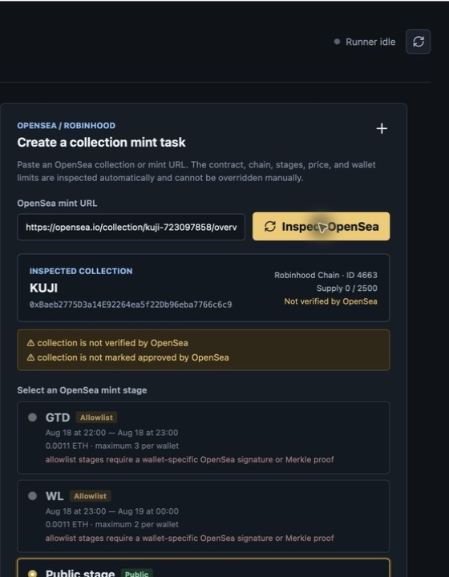

# MintDesk Robinhood 桌面版使用指南

本指南以 OpenSea 上的 [KUJI](https://opensea.io/collection/kuji-723097858/overview) 页面为例，演示从检查项目到创建、启动和停止公开铸造任务的完整流程。

> [!CAUTION]
> KUJI 只用于说明软件界面，不代表 MintDesk、维护者或本文对该项目的推荐或背书。截图采集于 2026-08-17（GMT+8）；项目页面、合约和铸造阶段可能随时变化。截图中的 KUJI 页面当时显示为 **Not verified by OpenSea**，并且没有可用于核对团队身份的公开官网或 X 链接。使用前必须独立核对项目身份、官方公告、合约、链、阶段、价格和钱包限额。

## 1. 下载和首次启动

从仓库的 [GitHub Releases](https://github.com/bizipoopoo/MintDesk/releases) 下载对应系统的安装包：

- macOS：`MintDeskRobinhood-macOS-universal.zip`，同时支持 Apple Silicon 和 Intel。
- Windows：`MintDeskRobinhood-Windows-x64-Setup.exe` 或 portable ZIP。

当前社区构建没有 Apple notarization 或商业 Windows 代码签名。运行前先确认下载来源是本仓库的 Release，并核对 Release 中提供的校验信息。只有在确认文件来源后，才使用 macOS 的“右键 → 打开”/“隐私与安全性 → 仍要打开”，或 Windows SmartScreen 的“更多信息”继续运行。

也可以按 [README 的构建说明](../README.md#desktop-app) 从源码自行构建。

## 2. 建立本地钱包保险库

打开左侧 **Wallets**。桌面版提供三种方式：

1. **Private keys**：每行粘贴一个专用热钱包私钥。
2. **Import phrase**：从已有助记词派生 1–20 个 EVM 地址。
3. **Generate**：生成新的 24 词助记词，并按 `m/44'/60'/0'/0/i` 派生 1–20 个地址。

输入 **Keystore password** 后导入。私钥会立即写入本机加密 keystore，任务 JSON 只保存公开地址；软件不会把明文私钥写入任务数据。新生成的助记词只显示一次，MintDesk 不会保存它，请离线备份后再从屏幕清除。

安全建议：

- 只使用余额受限、专门用于 mint 的热钱包，不要导入主钱包或长期资产钱包。
- 不要截图、提交或分享私钥、助记词、keystore 密码和带 API key 的 RPC URL。
- keystore 密码不能证明某个 NFT 项目安全，它只负责解锁本地签名。

## 3. 用 KUJI 检查 OpenSea mint 信息

打开左侧 **Mint tasks**，把下面的 URL 粘贴到 **OpenSea mint URL**：

```text
https://opensea.io/collection/kuji-723097858/overview
```

点击 **Inspect OpenSea**。MintDesk 会读取 OpenSea 页面中的合约、链、供应量、验证标记、阶段时间、价格和每钱包限额；这些值不能在任务表单中手工覆盖。



截图只保留公开项目信息，已裁掉本地钱包列表和 RPC 凭据。采集时界面解析到：

| 项目 | 界面显示值 |
| --- | --- |
| 合约 | `0xBaeb2775D3a14E92264ea5f22Db96eba7766c6c9` |
| 链 | Robinhood Chain，Chain ID `4663` |
| 供应量 | `2,500` |
| GTD | 2026-08-18 22:00–23:00（GMT+8），`0.0011 ETH`，每钱包最多 3 |
| WL | 2026-08-18 23:00–2026-08-19 00:00（GMT+8），`0.0011 ETH`，每钱包最多 2 |
| Public | 2026-08-19 00:00–01:00（GMT+8），`0.0011 ETH`，每钱包最多 5 |
| OpenSea 标记 | 未验证、未标记为 approved |

应用按照电脑的本地时区显示时间。跨时区使用时，应同时对照 OpenSea 和项目官方公告，确认电脑的日期、时间和时区设置正确。

### 为什么 GTD 和 WL 不能选择

KUJI 的 GTD/WL 是 allowlist 阶段，需要与具体钱包绑定的 OpenSea 签名或 Merkle proof。公开页面没有这些私有参数，所以 MintDesk 会显示阶段，但禁用自动任务。软件不会猜测 proof，也不会把 allowlist 任务悄悄改成 public mint。

当前桌面自动化只支持 OpenSea SeaDrop 的 **Public (`PUBLIC_SALE`)** 阶段。KUJI 示例中，只有 **Public stage** 可以用于创建任务。

## 4. 创建 Public mint 任务

检查结果无误后，在同一页继续向下填写：

1. **Select local wallets**：选择要使用的专用热钱包。每个钱包会生成一个独立执行任务。
2. **Collection task name**：保留项目名或填写便于识别的名称。
3. **Mint quantity per wallet**：填写每个钱包的数量。不得超过阶段总限额；钱包以前已经 mint 的数量也会占用限额。
4. **Mint monitoring speed**：
   - Extreme：100 ms
   - Fast：500 ms
   - Slow：2 秒
   - Very slow：5 秒
5. **Maximum fee per gas (Gwei)**：你愿意接受的最高 gas fee 上限。
6. **Maximum total cost per wallet (ETH)**：每个钱包允许的 `mint 价格 + 最坏情况 gas` 总上限。建议必须设置，并留出合理 gas 空间。
7. **Robinhood RPC**：使用可信的 Robinhood Chain RPC。公共端点可能限流；私人 RPC URL 可能包含 API key，不要截图或提交到 GitHub。
8. 点击 **Create collection for N wallets**。

多个钱包共用一个 RPC 时，MintDesk 会统一限速。更快的监控速度不会绕过 RPC 服务商的限流保护；出现频繁超时或 `429` 时，应换用可靠端点或降低速度。

## 5. 最后复核并启动

回到 **Overview**，确认 **Enabled tasks** 数量和任务信息正确，然后：

1. 输入创建钱包保险库时使用的 **Keystore password**。
2. 勾选 **I understand this may broadcast real transactions.**。
3. 点击 **Arm & start**。

这一步会让已启用任务具备真实广播权限。未来任务在本地计时，通常到阶段开始前 1 分钟才连接 RPC 并开始轮询。应用必须保持运行，电脑在 mint 窗口附近必须保持唤醒和联网。

广播前，MintDesk 会重新检查：

- RPC 的 Chain ID 是否为 `4663`；
- SeaDrop 公开阶段的价格和开始/结束时间；
- 当前钱包已经 mint 的数量和剩余供应量；
- fee recipient、钱包余额、gas 上限和总成本上限；
- 交易是否能通过 gas estimate/simulation。

每个任务最多广播一笔交易。RPC 在广播后返回超时可能意味着“结果不确定”，软件不会自动重发，以避免重复交易。广播不等于 mint 成功，最终状态以 Robinhood Chain 浏览器上的交易回执为准。

## 6. 停止、禁用和删除

- 运行中在 **Overview** 点击 **Stop runner**，停止当前 watcher。
- 停止 runner 后，在 **Mint tasks** 可对整个 collection 使用 **Disable all** 或 **Enable all**。
- **Delete** 会删除该 collection 下的所有钱包任务，但不会删除本地加密钱包。
- 任务在广播、失败、手动停止或阶段结束后会停止 watcher。再次启用前先检查交易回执和失败原因，不要因为界面暂时没有回执就重复广播。

runner 运行时，collection 的启用、禁用和删除会被锁定；先停止 runner 再修改。

## 7. 常见问题

**Inspect OpenSea 失败或没有阶段**

确认 URL 是 OpenSea collection/mint 页面、网络可访问，并点击 **Refresh** 后重试。如果页面没有公开完整阶段，MintDesk 不会自行推断。

**阶段能看到，但单选按钮不可用**

该阶段大概率需要钱包专属签名或 Merkle proof。当前版本只自动执行公开 SeaDrop 阶段。

**Create collection 按钮不可用**

至少选择一个本地钱包，并确认已经选中受支持的 Public 阶段。

**任务没有提前连接 RPC**

这是预期行为。未来任务先在本地等待，阶段开始前约 1 分钟才连接 RPC。

**到时间没有广播**

依次检查应用是否仍在运行、电脑是否唤醒、任务是否 enabled、runner 是否 armed、RPC 是否可用、钱包余额是否覆盖最坏情况总成本，以及 gas/总成本上限是否过低。

**OpenSea 信息和项目公告冲突**

不要启动。先通过项目官方账号、官网、OpenSea 页面和链上合约交叉核实。仅有粉丝数、付费认证、转发或第三方推广不能证明项目真实性。

## 启动前检查清单

- [ ] 使用的是专用低余额热钱包。
- [ ] 已从可信的一手来源核对项目身份和官方链接。
- [ ] OpenSea 合约与官方公布的合约完全一致。
- [ ] 链为 Robinhood Chain，Chain ID 为 `4663`。
- [ ] Public 阶段时间、价格、数量和每钱包限额一致。
- [ ] 电脑时区和系统时间正确。
- [ ] gas fee 与每钱包总成本上限符合自己的预算。
- [ ] RPC 来源可信，且没有把 RPC API key 分享或提交到仓库。
- [ ] 明白 **Arm & start** 可能广播真实交易，并已准备在链上核对回执。
